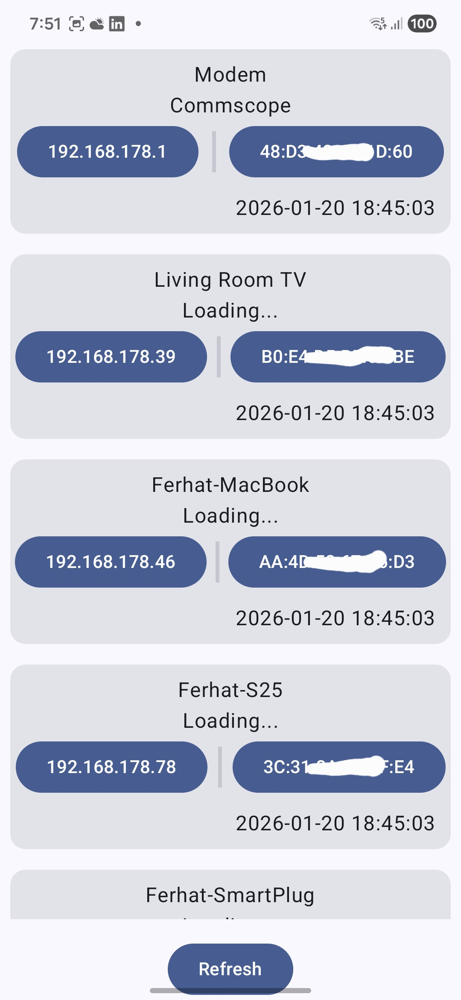
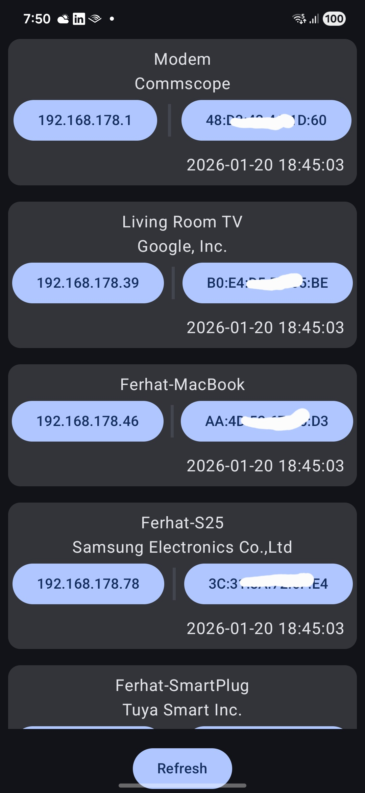

# WhoConnectedNG

## Project Overview

WhoConnectedNG is an Android application that discovers devices connected to your home network and displays basic device information. The app does not scan the network itself; instead, it fetches device data (IP and MAC addresses) from a small Node.js server that you run locally on a Raspberry Pi inside your home network. The Raspberry Pi server performs the LAN scan and returns a list of connected devices; the Android app then retrieves that list and shows each device's IP and MAC address in the UI.

For every MAC address the app receives, it queries macvendors.com to resolve the vendor (manufacturer) name and displays that vendor directly beneath the device's name. This helps you quickly identify which devices are phones, routers, smart TVs, etc.

All scanning and device collection occur locally on your Raspberry Pi and within your home network. The only external network call the app makes is to macvendors.com to look up vendor names — no device payloads or scan data are sent to third parties beyond that lookup.

This repository is presented by a computer engineering graduate who recently learned Android Kotlin development and has 2 years of professional experience in RPA (UiPath). I am currently applying for Junior Android Developer roles and this project highlights relevant skills for those positions.

Key skills and keywords: Kotlin, Android, Jetpack Compose, Retrofit, REST API, MVVM, ViewModel, Coroutines, UI, portfolio, RPA, UiPath.

---

<!-- Screenshots section (HTML table 5x2) -->
<h2>Screenshots</h2>
<!-- HTML table to display screenshots at original resolution -->
<table>
  <tr>
    <td></td>
    <td></td>
  </tr>
</table>

---

## How to run

- Open the project in Android Studio (Arctic Fox or newer recommended).
- Let Gradle sync and install any missing SDK components.
- Run the app on a physical device or an emulator configured with internet access.
- The main screen triggers data download on start (see `MainActivity` → `DeviceViewModel.downloadDeviceData()`).

Note: No additional setup steps are required in this README. If you need mock data or offline testing, create a local `screenshots/` folder and add images, or run the app with a connected test server.

---

## API notes

- Network code lives under `app/src/main/java/com/ferhat/whoconnectedng/api`.
- The project uses Retrofit instances created in `HomeService` and `MacVenService`. Those services define the base URLs inside their respective objects. (I intentionally do not publish those URL strings here.)
- Token flow: the app requests a token from `HomeApi.getMVToken()` and then uses that token as an Authorization header when calling the Mac Vendor API (`MacVenApi.getMacData(..., "Bearer <token>")`).
- Error handling: `DeviceViewModel` contains simple retry and delay logic around network calls and sets `successful` / `error` state flags used by the UI.

---

## Table of Contents (code files)

Below is a clickable listing of the folder and file structure under `app/src/main/java/com/ferhat/whoconnectedng`. These are relative links so they work locally or on GitHub without exposing any external URLs.

- api/
  - [HomeApi.kt](app/src/main/java/com/ferhat/whoconnectedng/api/HomeApi.kt)
  - [MacVenApi.kt](app/src/main/java/com/ferhat/whoconnectedng/api/MacVenApi.kt)
- model/
  - [Device.kt](app/src/main/java/com/ferhat/whoconnectedng/model/Device.kt)
  - [MacData.kt](app/src/main/java/com/ferhat/whoconnectedng/model/MacData.kt)
  - [Token.kt](app/src/main/java/com/ferhat/whoconnectedng/model/Token.kt)
- view/
  - [DeviceView.kt](app/src/main/java/com/ferhat/whoconnectedng/view/DeviceView.kt)
  - [DeviceListView.kt](app/src/main/java/com/ferhat/whoconnectedng/view/DeviceListView.kt)
  - [MainActivity.kt](app/src/main/java/com/ferhat/whoconnectedng/view/MainActivity.kt)
- viewmodel/
  - [DeviceViewModel.kt](app/src/main/java/com/ferhat/whoconnectedng/viewmodel/DeviceViewModel.kt)
- ui/theme/
  - [Color.kt](app/src/main/java/com/ferhat/whoconnectedng/ui/theme/Color.kt)
  - [Theme.kt](app/src/main/java/com/ferhat/whoconnectedng/ui/theme/Theme.kt)
  - [Type.kt](app/src/main/java/com/ferhat/whoconnectedng/ui/theme/Type.kt)

---

## Key files & where to look

- `app/src/main/java/com/ferhat/whoconnectedng/api/HomeApi.kt` — device list endpoint and token endpoint declarations; service builder is in `HomeService`.
- `app/src/main/java/com/ferhat/whoconnectedng/api/MacVenApi.kt` — Mac vendor lookup interface; service builder is in `MacVenService`.
- `app/src/main/java/com/ferhat/whoconnectedng/viewmodel/DeviceViewModel.kt` — business logic: fetching devices, retrieving vendor names, retry/delay strategy, and clipboard helper.
- `app/src/main/java/com/ferhat/whoconnectedng/view/DeviceListView.kt` and `DeviceView.kt` — Jetpack Compose UI that displays devices, brand names, and copy-to-clipboard buttons.
- `app/src/main/java/com/ferhat/whoconnectedng/view/MainActivity.kt` — app entry point and initial download trigger.

---

## What I learned / Why this matters

- Practical use of Retrofit to consume REST endpoints and map JSON to Kotlin data classes.
- Using Jetpack Compose for declarative UI and theme management (`ui/theme/*`).
- Applying a lightweight MVVM approach with `ViewModel`, `mutableStateOf`, and `mutableStateMapOf` to expose state to Compose.
- Simple resilience patterns: retries, delays, and error state propagation to the UI.

These are the precise skills I want recruiters to notice when evaluating this repository.

---

## Contact / Next steps

- If you are a recruiter or hiring manager: start by reviewing `view/`, `viewmodel/`, and `api/` to see API usage and Compose UI.
- To make screenshots appear in the README, add your images into a `screenshots/` folder at the project root with the filenames used in the table.

If you want, I can also:
- Convert the screenshot placeholders to links to files you add.
- Add a short sample of the JSON returned by the device endpoint (redacted) for clarity.
